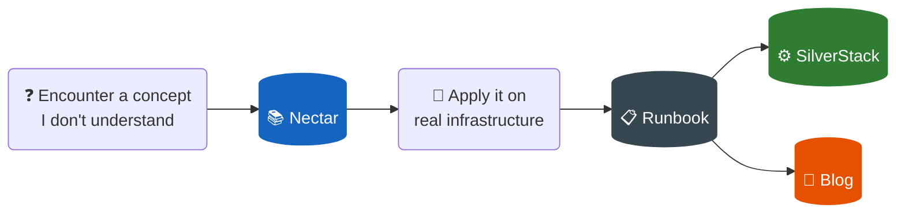

<h1 align="center">Muhammad Ibtisam Iqbal</h1>
<h3 align="center">DevOps Engineer · CKA · CKAD</h3>

  

## Who I Am

Not a CS graduate — my background is in agriculture sciences.
I came into DevOps and cloud engineering by choice, not by default.

Systems first, tools second. Document everything, understand everything,
don't move forward until the foundation is solid.

I work across Kubernetes, CI/CD pipelines, bare-metal clusters, and the automation that
makes infrastructure rebuildable rather than just runnable.

## What I Build

My learning and implementation follow a continuous pipeline:

```mermaid
flowchart LR
    A("❓ Encounter a concept\nI don't understand")
    --> B[("📚 Nectar")]
    --> C("🔧 Apply it on\nreal infrastructure")
    --> D[("📋 Runbook")]
    --> E[("⚙️ SilverStack")]

    D --> F[("📖 Blog")]

    style B fill:#1565C0,color:#fff,stroke:#1565C0
    style D fill:#37474F,color:#fff,stroke:#37474F
    style E fill:#2E7D32,color:#fff,stroke:#2E7D32
    style F fill:#E65100,color:#fff,stroke:#E65100
```

| Layer | What it contains | Where |
|---|---|---|
| **Portfolio** | Who I am and what I've built | [ibtisam-iq.com](https://ibtisam-iq.com) |
| **Projects** | Live project showcase | [projects.ibtisam-iq.com](https://projects.ibtisam-iq.com) |
| **Nectar** | First-principles notes on every concept I had to deeply understand | [nectar.ibtisam-iq.com](https://nectar.ibtisam-iq.com) |
| **Runbook** | Documented steps from real infrastructure work — commands, problems, solutions | [bootstrap.ibtisam-iq.com](https://bootstrap.ibtisam-iq.com) |
| **SilverStack** | Reusable Bash scripts, Kubernetes manifests, and IaC — what the Runbook links to | [github.com/ibtisam-iq/silver-stack](https://github.com/ibtisam-iq/silver-stack) |
| **Blog** | Distilled write-ups of what I built and what I learned | [blog.ibtisam-iq.com](https://blog.ibtisam-iq.com) |

## Certifications

- Certified Kubernetes Administrator (CKA)
- Certified Kubernetes Application Developer (CKAD)

## Principles

- Rebuildable > runnable once
- Systems > individual tools
- Understanding > memorisation
- Clarity over shortcuts

> **Running something once is learning. Rebuilding it reliably is engineering.**

## Links

- DebugBox → [debugbox.ibtisam-iq.com](https://debugbox.ibtisam-iq.com)
- LinkedIn → [linkedin.com/in/ibtisam-iq](https://www.linkedin.com/in/ibtisam-iq)
- Portfolio → [ibtisam-iq.com](https://ibtisam-iq.com)
