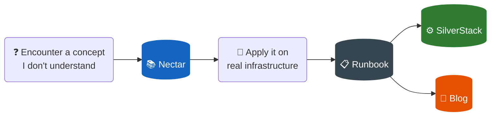

<h1 align="center">Muhammad Ibtisam Iqbal</h1>
<h3 align="center">DevOps Engineer · CKA · CKAD</h3>

  

## Who I Am

DevOps Engineer with 2.5 years of hands-on infrastructure work, CKA and CKAD certified (Nov 2025),
specializing in Kubernetes, CI/CD pipelines, and DevSecOps automation.

Master's degree. Non-traditional background. Every skill here was deliberately built —
not assigned by a curriculum.

> Systems first, tools second. Document everything, understand everything,
> don't move forward until the foundation is solid.

## Experience

- **2.5 years** of full-time, self-directed DevOps engineering (Nov 2023 - Present)
- Designed and deployed CI/CD pipelines for Java, Python, and Node.js applications across 3+ stacks
- Built and managed Kubernetes clusters on bare-metal, AWS EKS, and AWS ECS
- Automated multi-environment deployments with Jenkins and GitHub Actions - from code commit to production
- Integrated security scanning (SonarQube, Trivy) into pipelines as first-class stages, not afterthoughts
- Set up and managed private container registry (Nexus), Nginx ingress, DNS, and SSL/TLS end-to-end
- No corporate employment yet - this profile and the linked projects below are the evidence

## Tech Stack

**Orchestration:** Kubernetes (bare-metal, EKS), Docker, Helm, Kustomize  
**CI/CD:** Jenkins, GitHub Actions  
**Cloud:** AWS (EKS, ECS, EC2, S3, IAM, VPC)  
**Security:** SonarQube, Trivy, secrets management  
**IaC & Scripting:** Bash, YAML, Groovy  
**Databases:** MySQL, PostgreSQL  
**Networking:** Nginx, DNS, SSL/TLS, Ingress controllers  
**OS:** Linux (Ubuntu), macOS  

## What I've Built

All work is documented, versioned, and live:

- **[SilverStack](https://github.com/ibtisam-iq/silver-stack)** - Production-ready Kubernetes manifests,
  Bash automation scripts, and IaC templates used across all projects
- **[Runbook](https://runbook.ibtisam-iq.com)** - Real infrastructure commands, failures, and
  solutions documented as they happened - not sanitized after the fact
- **[Projects](https://projects.ibtisam-iq.com)** - Live project deployments with full CI/CD pipelines
  (Java, Python, Node.js apps on EKS, ECS, and bare-metal)
- **[Nectar](https://nectar.ibtisam-iq.com)** - First-principles technical notes built while
  implementing, not while watching
- **[Blog](https://blog.ibtisam-iq.com)** - Distilled write-ups of what I built and what I learned
- **[DebugBox](https://debugbox.ibtisam-iq.com)** - A lightweight, variant-based debugging container suite for Kubernetes and Docker environments

How everything connects:

```mermaid
flowchart LR
    A("❓ Encounter a concept\nI don't understand")
    --> B[("📚 Nectar")]
    --> C("🔧 Apply it on\nreal infrastructure")
    --> D[("📋 Runbook")]
    --> E[("⚙️ SilverStack")]

    D --> F[("📖 Blog")]

    style B fill:#1565C0,color:#fff,stroke:#1565C0
    style D fill:#37474F,color:#fff,stroke:#37474F
    style E fill:#2E7D32,color:#fff,stroke:#2E7D32
    style F fill:#E65100,color:#fff,stroke:#E65100
```

## Certifications

| Certification | Issuer | Issued | Verify |
|---|---|---|---|
| Certified Kubernetes Administrator (CKA) | Linux Foundation | Nov 2025 | [Verify ↗](https://www.credly.com/badges/0f1fd462-102e-42e8-932c-ebd4222d5587) |
| Certified Kubernetes Application Developer (CKAD) | Linux Foundation | Nov 2025 | [Verify ↗](https://www.credly.com/badges/13e7993c-8bc1-4f82-822d-7382322f7b88) |

## Principles

- Rebuildable > runnable once
- Systems > individual tools
- Understanding > memorisation
- Clarity over shortcuts

> **Running something once is learning. Rebuilding it reliably is engineering.**

## Currently

📍 Islamabad, Pakistan · Open to remote roles globally  
📬 Actively looking - reach me at [linkedin.com/in/ibtisam-iq](https://www.linkedin.com/in/ibtisam-iq)  
🌐 Portfolio → [ibtisam-iq.com](https://ibtisam-iq.com)
