<h1 align="center">Muhammad Ibtisam Iqbal</h1>
<h3 align="center">Infrastructure • Cloud • Kubernetes</h3>

  

## Engineering Focus

I build and operate real environments to understand how systems behave, and then turn that understanding into reproducible infrastructure.

My work is centred on:

- running complete setups end-to-end  
- making them rebuildable from scratch  
- extracting reusable platform components

## Working Model

My learning and implementation follow a continuous lifecycle:

```mermaid
flowchart TD
    A(["❓ I don't understand something"])
    B["First-principles learning<br/>Deep mental model"]
    C(["🔧 I run it for real"])
    D["Full implementation<br/>Debugging & experiments"]
    E(["💡 It becomes clear & repeatable"])
    F["Reusable manifests<br/>Scripts & IaC"]
    G(["✍️ I explain the practical path"])
    H["Distilled, problem-oriented<br/>write-up"]
    I(["🏗️ Multiple components form a platform"])
    J["System view<br/>& architecture"]

    A --> B --> NECTAR[("<b>📚 Nectar</b>")]
    C --> D --> NECTAR
    NECTAR --> E --> F --> SILVER[("<b>⚙️ SilverStack</b>")]
    NECTAR --> G --> H --> BLOG[("<b>📝 Blog</b>")]
    NECTAR --> I --> J --> PROJECTS[("<b>🏛️ Projects</b>")]

    style NECTAR   fill:#1565c0,color:#ffffff,stroke:#90caf9
    style SILVER   fill:#2e7d32,color:#ffffff,stroke:#a5d6a7
    style BLOG     fill:#e65100,color:#ffffff,stroke:#ffcc80
    style PROJECTS fill:#9c27b0,color:#ffffff,stroke:#e1bee7
```

## Current Direction

- Kubernetes-based platforms  
- CI/CD infrastructure  
- Infrastructure as Code  
- Private networking & service exposure  
- System lifecycle automation

## Certifications

- Certified Kubernetes Administrator (CKA)  
- Certified Kubernetes Application Developer (CKAD)

## Achievements

- Silver Medalist  
- Open-source contributor  
- Technical writing  

## Principles

- Rebuildable > runnable once  
- Systems > individual tools  
- Understanding > memorisation  
- Clarity over shortcuts

> **Running something once is learning. Rebuilding it reliably is engineering.**

## Engineering Platforms

- Portfolio → https://ibtisam-iq.com
- DebugBox → https://debugbox.ibtisam-iq.com
- Knowledge Base → https://nectar.ibtisam-iq.com  
- Engineering Blogs → https://blog.ibtisam-iq.com
- Infra Bootstrap → https://bootstrap.ibtisam-iq.com
- Certificate Practice Vault → https://cert-vault.ibtisam-iq.com
- [LinkedIn](https://www.linkedin.com/in/ibtisam-iq)
